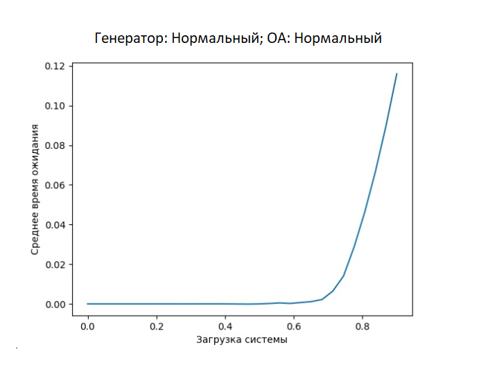
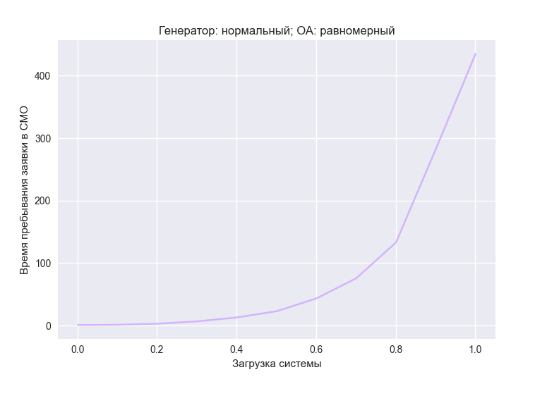

# Лабораторная работа №1

## Задание
Разработать имитационную модель  функционирования СМО.
СМО представляет собой одноканальную разомкнутую систему (один генератор заявок и один обслуживающий аппарат). Буфер имеет бесконечную емкость.

Закон поступления (генерации заявок) и закон распределения  времени обслуживания заявок задается в таблице и выбирается в соответствии с номером в списке группы.

В качестве исходных данных пользователь задает интенсивность поступления заявок и интенсивность обслуживания заявок. Пользователь должен иметь возможность задавать время моделирования.Программа должна выводить расчетную загрузку системы и фактическую, полученную по результатам моделирования. 

Если параметры законов распределения отличны от интенсивности, то предусмотреть ввод интенсивностей с дальнейшим пересчетом в программе этих величин в параметры закона. В случае двухпараметрических законов пользователь задает интенсивность и ее разброс (среднеквадратическое отклонение). Учесть, что рассматриваемые случайные величины принимают положительные значения (интервалы между приходом требований и времена обслуживания).

Построить график зависимости выходного параметра (ср. время ожидания (пребывания) в зависимости от загрузки системы). Предусмотреть наращивание системы путем добавления новых генераторов и обслуживающих аппаратов.
Подготовить отчет по лабораторной работе.

## Вопросы

### Пассивный vs Активный эксперимент

* **Разница активного и пассивного эксперимента**  
* **Какой опыт проводили?** Пассивный
 
При **пассивном эксперименте** ставится большая серия опытов с поочередным(!) варьированием каждой из переменных.   
 
**Активный эксперимент** ставится по заранее составленному плану (планирование эксперимента), при этом предусматривается одновременное изменение всех параметров, влияющих на процесс, что позволяет сразу установить силу взаимодействия параметров и поэтому сократить общее число опытов.  
  
В том и другом случае обработка опытных данных ведется методами корреляционного и регрессионного анализа. Сюда относится также сбор исходного статистического материала в режиме нормальной эксплуатации промышленного -объекта. 

* **Какие преимущества у активного эксперимента?**
	* возможность предсказания количества опытов, которые следуют провести
	* определение точек факторного пространства, где следует проводить опыты
	* отсутствие проблем, связанных с выбором вида уравнения регрессии; 
	* возможность определения оптимальных параметров процесса экспериментально-статистическим методом; 
	* сокращение объёма опытных исследований. 

### Планирование эксперимента					
* **Как планировали эксперимент?** Не планировали.
  Планирование эксперимента происходит во время активного эксперимента.

* **Какие цели у планирования эксперимента?**
  1. Сокращение общего объёма испытаний при соблюдении требований к достоверности и точности их результатов;
  2. повышение информативности каждого из экспериментов в отдельности.

### Остальные вопросы
* **Когда собираемся исследовать систему, какая есть предварительная формальность?** 
  1. помнить, к какому классу относится моделируемая система (статическая/**динамическая**, детерминированная/**стохастическая**, и т.д.); 
  2. определить, какой режим работы интересует, **стационарный (установившийся)** или нестационарный; 
  3. знать, в течение какого промежутка времени следует наблюдать за поведением (функционированием ) системы; 
  4. знать, какой объём испытаний (то есть повторных экспериментов) сможет обеспечить требуемую точность оценок (в статистическом смысле) исследуемых характеристик системы. 
				 				
* **Что такое стационарный режим?**  
  Очередь и время ожидания не растут бесконечно, интервал загрузки от 0 до 1.

* **Что в результате опытов должны получить?** Информацию об объекте

### График
* **Зачем нужен график?** (ответ про сравнение теор и фактич значение не пойдет)  
  Вид уравнения регрессии необходимо определять по характеру изменения переменных на графике эмпирической линии регрессии, полученной по выборке экспериментальных данных.**(??)** За счет графика определяем вид уравнения регрессии. Обычно линейный от 0 до 0.5-0.6. (Нам это знание в след. лабах понадобится)

* **Что делать с той частью графика, где вид уравнения регрессии перестает быть линейным?**   
  Можем также исследовать разными способами. Самый простой - выразить кривую как ломаную, а потом рассматривать по отдельности кусочки этой ломаной.
				
* **Как ломаный график сгладить**  
  * Можно использовать интерполяцию (ответ не понравился, но так точно кто-то делал))
  * Взять меньше шаг по x (посчитать больше точек просто)
  * (А если у вас он прям скачет - брать среднее нескольких результатов в этом x)

* **Почему график такой пологий**. (Это зависит от законов)  
  Ввиду характера нормального закона.
  

  Для сравнения другие два закона:
  
  Последний график немного ломаный, по хорошему бы чуть сгладить.

* **У вас откуда график начинается**  
  Вообще у меня(и еще у половины потока) с 1, но это неправильно поэтому сказала, что **с 0** (на моем графике это незаметно))).
 
*Где то было такое объяснение почему с 1:* время пребывания начинается с 1, так как интенсивность обработки заявки = 1 (время обработки =1))

P.S.: от меня в этой лабе лавандовый интерфейс  
P.P.S: хочу в академ(
